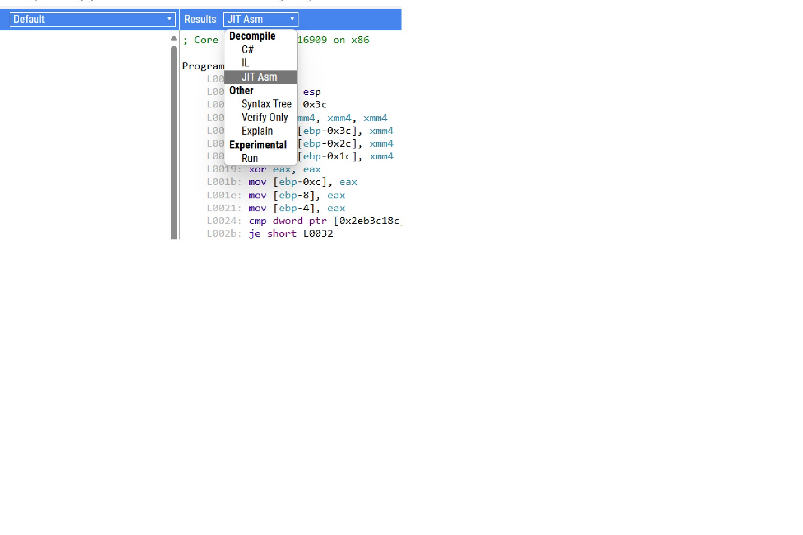
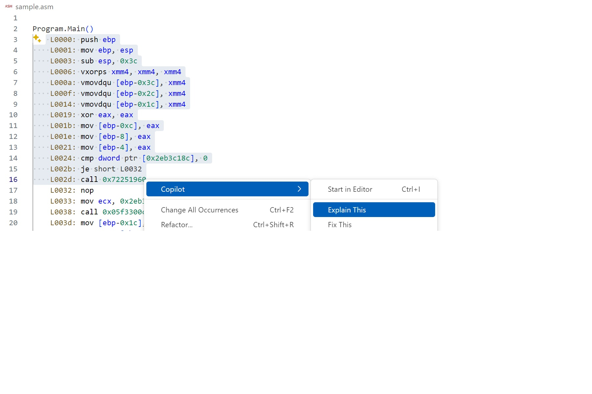

# Using Copilot for Assembly Language

## Overview

Copilot is a great tool to help with Assembly Language development, especially since all of this knowledge would be part of an LLM by virtue of the fact these architectures have been around for years.  The tool can help you with the assembly language code with /explain the code capability from a right mouse click - CoPilot sub-menu. 

This is a great way to learn assembly language for the CPU you are targeting.  I am going to use x86_64 as my target CPU.  The Disassembler will show you the assembly language for the C# code you have written.  Copy it into a file and save it as a .asm file.  Next install the Assembly Language extension of Visual Studio Code.  At this point you can use the Assembly Language extension for Visual Studio Code to edit and compile your code or use a tool like NASM ( or install the VSC Extension) to compile your code.  

Also Copilot can help you with the assembly language code with /explain the code capabilty from a right mouse click - CoPilot sub-menu.  This is a great way to learn assembly language for the CPU you are targeting.  I am going to use x86_64 as my target CPU.  

### Lab Objectives

Since my Assembly Language Skills are dated, circa VAX/VMS and 6502 (8 bit) microprocessors.  I am going to start off with C#, and will create assembly language that we can use in CoPilot.

We will use either Visual Studio or Visual Studio Code as the IDE to create our code. To get Assembly Language (and this can generate several CPU architectures) we will use SharpLab ( https://sharplab.io )

## C# Code

```csharp
using System.Collections.Generic;
using System;

public static class Program
{
    public class Stack<T>
    {
    private List<T> elements = new List<T>();

    public void Push(T item)
    {
        elements.Add(item);
    }

    public T Pop()
    {
        if (elements.Count == 0)
        {
            throw new InvalidOperationException("Stack is empty");
        }

        var item = elements[elements.Count - 1];
        elements.RemoveAt(elements.Count - 1);
        return item;
    }

    public bool IsEmpty()
    {
        return elements.Count == 0;
    }
  }
    
 public static void Main() {
     
     var stack = new Stack<int>();
     stack.Push(1);
     stack.Push(2);
     stack.Push(3);

     while (!stack.IsEmpty())
     {
       Console.WriteLine(stack.Pop());
     }
     
     var b = new object[] { 1, 2, 3 };
     var a = new int[] {2, 4, 6 };
     Inspect.MemoryGraph(a, b);
     
     var str = "Hello World";
     Inspect.Heap(str);
     
     int value = 1200000;
     Inspect.Stack(value);
 }
}
```
The next thing to do after adding your C# code is to invoke the SharpLab Disassembler
  I think it is best to learn the assembly language for the CPU you are targeting.  I am going to use x86_64 as my target CPU.  Copy it into a file and save it as a .asm file.

Next install the Assembly Language extension of Visual Studio Code
 -- See Appendix A for more information


At this point you can use the Assembly Language extension for Visual Studio Code to edit and compile your code or use a tool like NASM ( or install the VSC Extension) to compile your code -- See Appendix B about NASM.  Also Copilot can help you with the assembly language code with /explain the code capabilty from a right mouse click - CoPilot sub-menu, as shown below.

From the selected code, my response from copilot is shown in the next section.

### CoPilot Response

This assembly code is written in Intel syntax and it's for the x86 architecture. The code appears to be a function prologue and some initial setup for a function.

At `L0000`, it starts with `push ebp`. This instruction saves the current base pointer (ebp) onto the stack. This is typically done at the start of a function to save the previous function's base pointer.

Next, at `L0001`, `mov ebp, esp` is setting the base pointer (ebp) to the current stack pointer (esp). This sets up a new stack frame for the current function.

At `L0003`, `sub esp, 0x3c` is subtracting 60 (0x3c in hexadecimal) from the stack pointer, effectively allocating 60 bytes of local stack space for this function.

The next three instructions, `vxorps xmm4, xmm4, xmm4` and `vmovdqu [ebp-0x3c], xmm4`, `vmovdqu [ebp-0x2c], xmm4`, `vmovdqu [ebp-0x1c], xmm4`, are using SIMD (Single Instruction, Multiple Data) instructions to zero out 48 bytes of the local stack space.

Then, `xor eax, eax` is a common way to set the eax register to zero. The next three instructions, `mov [ebp-0xc], eax`, `mov [ebp-8], eax`, `mov [ebp-4], eax`, are storing the zero value from eax into the last 12 bytes of the local stack space.

At `L0024`, `cmp dword ptr [0x2eb3c18c], 0` is comparing the 32-bit value at memory address 0x2eb3c18c to zero. If the value at that memory address is zero, the `je short L0032` instruction will jump to the code at label L0032.

Finally, if the value at the memory address was not zero, `call 0x72251960` will be executed, which calls the function at address 0x72251960.

## Appendix A: Assembly Language Extension for Visual Studio Code

The x86 and x86_64 Assembly extension for Visual Studio Code provides syntax highlighting and code snippets for x86 and x86_64 (AMD64) assembly languages. Here's how you can use it:

1. **Installation**
   Open Visual Studio Code, go to the Extensions view by clicking on the Extensions icon in the Activity Bar on the side of the window. In the search box, type "x86" and look for the "x86 and x86_64 Assembly" extension. Click on the Install button to install it.

2. **Syntax Highlighting**
   Once the extension is installed, it will automatically provide syntax highlighting for files with the `.asm`, `.s`, `.inc` extensions. Simply open your assembly files in Visual Studio Code and you should see the syntax highlighting.

3. **Code Snippets**
   The extension also provides code snippets which are chunks of code that you can insert into your files. To use a snippet, start typing the name of the snippet in your file and you should see a dropdown with matching snippets. Select the snippet you want to use and press Enter. The snippet will be inserted at your cursor.

4. **Configuration**
   If you want to customize the behavior of the extension, you can do so by going to the settings. Click on the gear icon in the lower left corner of the window, select "Settings", and then search for "x86". You'll see the settings for the x86 and x86_64 Assembly extension.

Remember, this extension does not provide features like assembling, linking, or debugging assembly code. For those features, you would need to use other tools or extensions.

## Appendix B: NASM 

NASM, or the Netwide Assembler, is an assembler and disassembler for the Intel x86 architecture. It can be used to write both 16-bit and 32-bit programs. NASM is widely used for writing low-level system software because it provides a simple syntax and flexible macro system, making it easier to write complex programs.

Here are some of the best tools for working with NASM:

1. **Visual Studio Code with the x86 and x86_64 Assembly extension**: This setup provides syntax highlighting and code snippets, making it easier to write and understand assembly code.

2. **NASM itself**: The assembler is a crucial tool for compiling your assembly code into machine code.

3. **rdare2**: This is a comprehensive reverse-engineering tool that includes a disassembler. It can be used to inspect the output of NASM and understand how it works.

4. **GDB (GNU Debugger)**: This is a powerful debugger for many languages, including assembly. It can be used to step through your code and inspect the state of the system at each step.

5. **Hex Editors like HxD or Hex Fiend**: These can be used to inspect the binary output of NASM.

6. **Docker**: Docker can be used to create a consistent development environment for NASM, especially if you are collaborating with others.

Remember, the best tools often depend on your specific needs and workflow.
